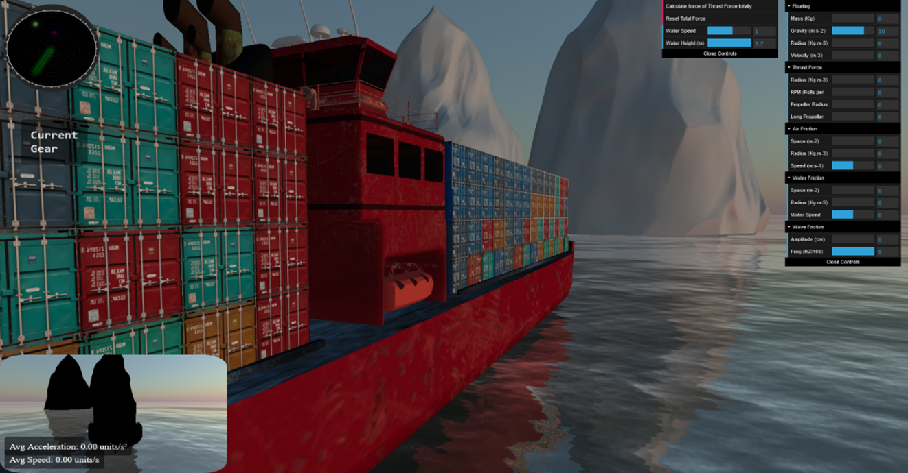
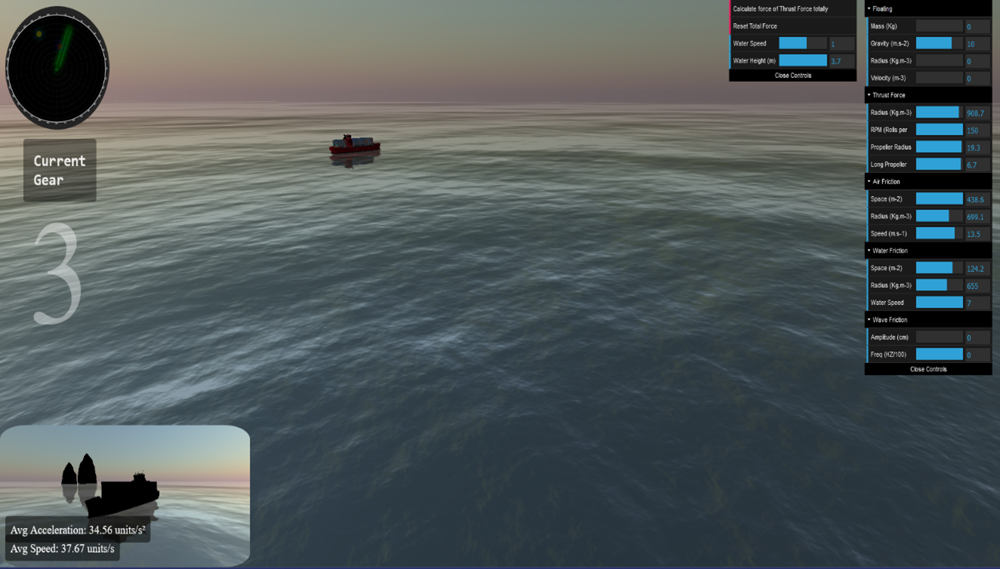
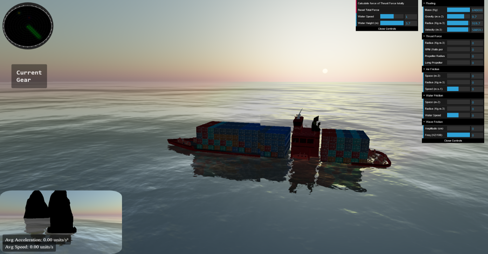
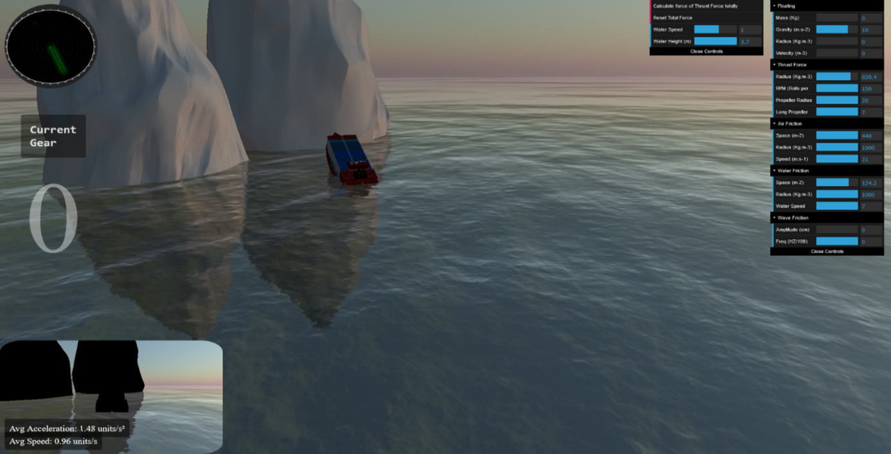

# Cargo Ship
## [🚀Intro](#Intro)
يهدف هذا المشروع إلى دراسة الحركة الفيزيائية لسفينة تجارية وتحليل القوى المؤثرة عليها مثل الطفو والمقاومة والجاذبية. تم بناء نموذج رياضي دقيق يحاكي سلوك السفينة في الماء اعتمادًا على قوانين الفيزياء. بعد ذلك، تم تطوير خوارزمية لحساب الحركة الديناميكية بناءً على المدخلات البيئية. تمت المحاكاة باستخدام مكتبة Three.js لتقديم تمثيل ثلاثي الأبعاد تفاعلي. يساهم المشروع في فهم أفضل لاستقرار وأداء السفن التجارية تحت ظروف مختلفة.
## [⚒️ Frameworks & Tools](#Frameworks-&-Tools)

## [👥Team Members](#Team-Members)
| S.N   | Name                                                                     | Role                               |                          
|-------|---------------------------------------------------------------------------|-----------------------------------|
| 1     | 👨‍🔬Mustafa Sharaf   |🔹 الدراسة الفيزيائية   🔹 الدراسة الخوارزمية |  
| 2     | 👨‍💻 Mhran Abo Dakka | 🔸 برمجة الفيزياء   🔸  برمجة الرسوميات | 

## [🖼️Project Preview](#Project-Preview)

